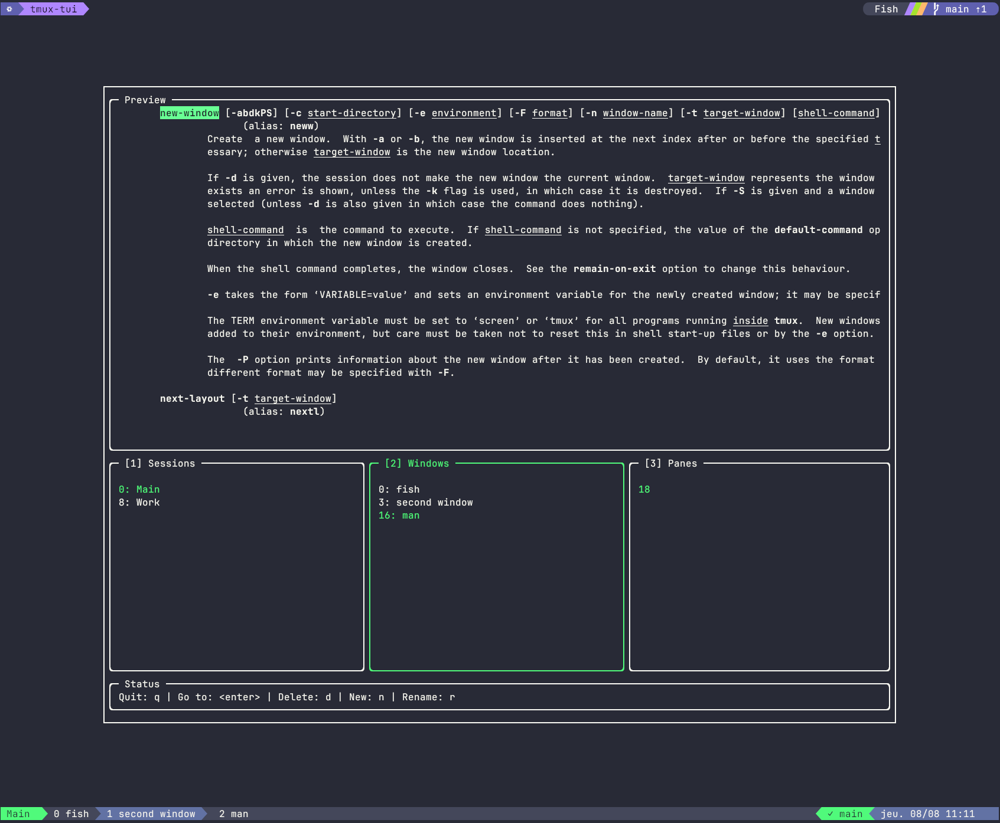

# tmux-tui

Manages tmux sessions, windows and panes in a Terminal User Interface inspired by lazygit.



## Implemented actions

|         | Create | Destroy | Rename| Go to | Swap |
| :---    | :---   | :---    | :---  | :---  | :--- |
| Session | ✓      | ✓       | ✓     | ✓     | ✗    |
| Window  | ✓      | ✓       | ✓     | ✓     | ✓    |
| Pane    | ✓      | ✓       | ✗     | ✓     | ✓    |

## Themes

The following themes are supported. Invoke with `-t gruvbox-dark` to launch with the Gruvbox Dark
theme, for example.

|Name                |Option name         |
|:---                |:---                |
| Ayu Dark           |`ayu-dark`          |
| Cobalt2            |`cobalt2`           |
| Dracula            |`dracula`           |
| Dracula Pro        |`dracula-pro`       |
| GitHub Dark        |`github-dark`       |
| Gruvbox Dark       |`gruvbox-dark`      |
| Gruvbox Light      |`gruvbox-light`     |
| Material Palenight |`material-palenight`|
| Monokai            |`monokai`           |
| Night Owl          |`night-owl`         |
| Nord               |`nord`              |
| Oceanic Next       |`oceanic-next`      |
| One Dark           |`one-dark`          |
| One Light          |`one-light`         |
| PaperColor Dark    |`papercolor-dark`   |
| PaperColor Light   |`papercolor-light`  |
| Solarized Dark     |`solarized-dark`    |
| Solarized Light    |`solarized-light`   |
| Synthwave '84      |`synthwave`         |
| Tokyo Night        |`tokyo-night`       |
| Tomorrow Night     |`tomorrow-night`    |

## Installation

Install with go:

```bash
go install github.com/acristoffers/tmux-tui@latest
```

or use nix:

```bash
nix profile install github:acristoffers/tmux-tui
```

And add the following line to your `tmux.conf` to open it in a popup window (scratch window):

```tmux
bind-key O display-popup -E -b rounded -w '80%' -h '80%' tmux-tui
```

You can experiment with the width and height (`-w` and `-h`, respectively).
